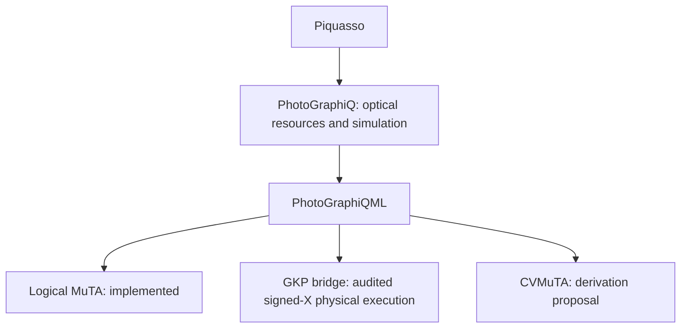

# PhotoGraphiQML

Trainable logical MuTA models with an explicit bridge to PhotoGraphiQ's finite-energy GKP resources.

[](https://github.com/chinmoybiswasdeep/PhotoGraphiQML/actions/workflows/ci.yml)
[](LICENSE)
[](https://github.com/chinmoybiswasdeep/PhotoGraphiQML/releases)
[](https://github.com/chinmoybiswasdeep/PhotoGraphiQML/issues)
[](https://github.com/chinmoybiswasdeep/PhotoGraphiQML/pulls)
[](https://github.com/chinmoybiswasdeep/PhotoGraphiQML)

Research software, version 0.2.0. Logical MuTA is executable and independently
validated. `PhysicalMuTA` executes the restricted 0/pi signed-X family through
PhotoGraphiQ 0.3.1 finite GKP primitives. Arbitrary-angle physical MuTA remains
**unsupported**, with rejection before Fock allocation. CVMuTA remains a
separate derivation proposal pending that bridge. These are three distinct
scientific models. See the [release report](docs/release-report.md).




## Install from source

Python 3.11–3.14 is targeted; see the release report for versions actually run.
Install the audited PhotoGraphiQ revision, then this repository:

```bash
python -m pip install "photographiq @ git+https://github.com/chinmoybiswasdeep/PhotoGraphiQ.git@db07f9f9bf47da841bfa6b206562c5a3ffb121d3"
python -m pip install -e ".[dev,docs]"
```

For optional independent MentPy validation:

```bash
python -m pip install -r tests/mentpy_reference/requirements.txt
python -m pytest
```

Core execution does not import MentPy. `.[validation]` installs its release;
the requirements file pins the exact audited source revision.

## Five-minute example

```python
import numpy as np
import photographiqml as pqml

# one_column=True means one paper (2,0) layer.
model = pqml.MuTA(2, 1, one_column=True, representation="logical")
result = model.run([1, 0, 0, 0], {"alpha.w1.c1": np.pi / 2})
print(result.probabilities)  # [0.5, 0, 0, 0.5], up to numerical roundoff
print(model.summary())
```

Without `one_column=True`, each requested layer cycles through every pivot
wire, matching MentPy's convention. Angles are in radians. Inputs must already
be normalized; named parameters default to stored values (initially zero).
`restrict_trainable=True` explicitly fixes column 3 at X across all layers.
The full paper ansatz, with all four measurements per wire trainable, is the
default. This fixes a documented upstream trainability inconsistency.

## Train and predict

```python
from photographiqml import MuTAClassifier, Trainer

classifier = MuTAClassifier(
    pqml.MuTA(1), trainer=Trainer(epochs=60), seed=0
)
classifier.fit([[0.0], [0.1], [3.0], [3.14]], [1, 1, 0, 0])
print(classifier.predict([[0.05], [3.1]]))  # [1, 0]
```

This example fits a small classical dataset using explicit product Ry encoding.
It is a functionality demonstration, not an advantage benchmark.

## Restricted physical execution

```python
from photographiqml import PhysicalMuTA, GKPPhysicalConfig, compare_logical_physical

physical = PhysicalMuTA(physical_config=GKPPhysicalConfig(
    cutoff=40, peak_width=.9, envelope=.9, peaks=4, grid_points=1025))
result = physical.run([1, 0], mode="physical-shots", shots=4, seed=14)
print(result.decoded_joint_probabilities)
print(compare_logical_physical(result))
```

This broad finite resource illustrates execution; it is not convergence-certified.
Only intermediate XY angles 0/pi modulo 2pi are supported, with upstream absolute
tolerance 1e-14. Output readout supports X/Z. Arbitrary angles fail before Fock
allocation. The raw physical result, decoded probabilities and ideal logical target
remain separate. Legacy `MuTA(..., representation="gkp")` stays resource-only.

## Features and scientific boundaries

- Semantic triangle graphs, causal flow and ideal logical inference.
- PhotoGraphiQ symbolic parameters, initialization, freezing and JSON model state.
- Adam/SGD and SciPy L-BFGS, deterministic finite differences and histories.
- Binary classifiers, scalar regressors, quantum-output instruments and Eq. 5 kernels.
- Logical concurrence, pure-state QFI, Pauli Lie closure and local Fisher diagnostics.
- GKP resource projection, overlap and cutoff/grid diagnostics through PhotoGraphiQ.
- Capability-audited physical lowering, virtual Pauli frames and joint output readout.
- Conditional analog branches, physical shots, discrete search and decoded supervised features.
- Table I identities, all small adaptive branches and optional MentPy comparisons.

MentPy validates qubit structure and logical outputs; it never serves as an
oracle for arbitrary CV physics. There is no `alpha -> homodyne angle`
substitution. Arbitrary logical XY measurement synthesis and its finite-resource
validation remain prerequisites for full physical MuTA. See [physical architecture](docs/physical/architecture.md),
[supported measurements](docs/physical/supported-measurements.md), [research mapping](docs/research/muta-mapping.md),
[tutorials](docs/tutorials/index.md), [API shapes](docs/api.md), and
[reproducible gate learning](experiments/paper_reproduction/README.md).

Build docs with `mkdocs build --strict`; run local checks with
`python scripts/validate_release.py`. CI defines the Python matrix and an
optional pinned MentPy job. No published workflow or release status is
asserted by the dynamic badges.

## Cite and contribute

MuTA: L. Mantilla Calderón, R. Raussendorf, P. Feldmann, D. Bondarenko,
*Measurement-based quantum machine learning*, PRA **113**, 042421 (2026),
[doi:10.1103/2snk-m8c6](https://doi.org/10.1103/2snk-m8c6).
Reference software: [MentPy](https://github.com/mentpy/mentpy), Apache-2.0.
Optical engine: [PhotoGraphiQ](https://github.com/chinmoybiswasdeep/PhotoGraphiQ).

See [CITATION.cff](CITATION.cff), [CONTRIBUTING.md](CONTRIBUTING.md),
[ROADMAP.md](ROADMAP.md), and [MIT license](LICENSE).
