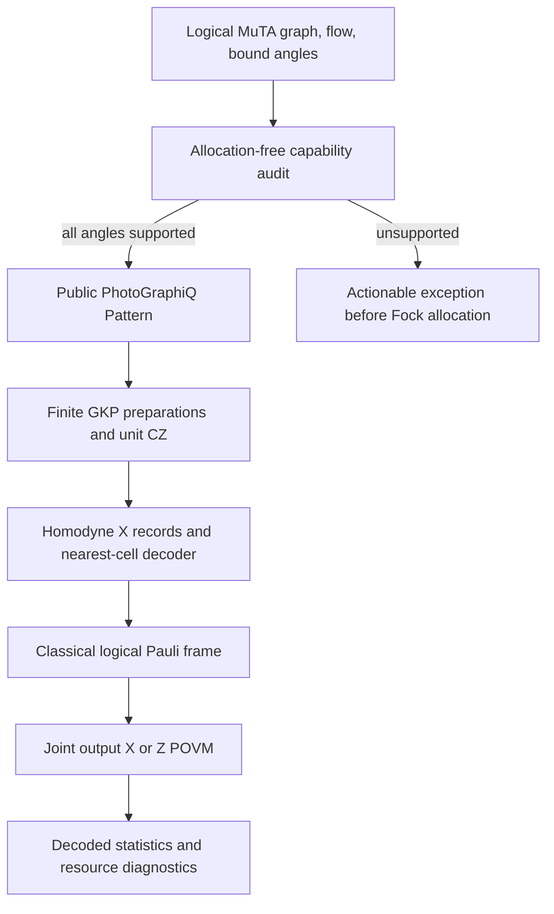

# Physical GKP architecture

PhotoGraphiQML 0.2.0 adds physical execution of MuTA's **signed-X subset**.
Logical MuTA remains the qubit reference model, validated against MentPy.
CVMuTA remains a separate derivation proposal: replacing triangle vertices with
oscillators does not establish the same model or a continuous-variable generalization.

## Dependency contract

The runtime requirement is `photographiq>=0.3.1,<0.4`. CI pins
[`db07f9f9bf47da841bfa6b206562c5a3ffb121d3`](https://github.com/chinmoybiswasdeep/PhotoGraphiQ/tree/db07f9f9bf47da841bfa6b206562c5a3ffb121d3).
`check_photographiq_contract()` checks the installed version and public symbols.
The audited upstream contract lives in
[`docs/development/photographiqml-contract.md`](https://github.com/chinmoybiswasdeep/PhotoGraphiQ/blob/db07f9f9bf47da841bfa6b206562c5a3ffb121d3/docs/development/photographiqml-contract.md).
No private encoded-state, decoder, or backend implementation is imported.

## Representations and migration

| API | Meaning | Execution |
| --- | --- | --- |
| `MuTA(..., representation="logical")` | Ideal qubit graph and adaptive flow | Arbitrary supported logical XY angles |
| Legacy `representation="gkp"` | Resource-only v0.1 intent; deprecated alias | Keeps its execution exception |
| `representation="gkp-resource"` | Explicit resource-only model | Ideal target through `GKPBridge.logical_target` |
| `PhysicalMuTA(...)` | `gkp-physical`, finite resources | Audited 0/pi family only |

`GKPBridge.run(logical_model, ..., config=...)` is an explicit request to lower
a fixed logical pattern; it performs the same preflight as `PhysicalMuTA.run`.
Loading a schema-1 resource model never silently converts it to physical execution.
Schema 2 stores the physical family and every resource/allocation setting.

## Resource model

`GKPPhysicalConfig` specifies cutoff, peak width, envelope, peak count,
integration grid, backend, decoder, dimension budget and matrix budget.
`GKPCode.encode` builds normalized finite codeword superpositions. Nonorthogonal
finite codewords do not define an exact isometric DV-to-CV encoding channel.
Product logical inputs are supported; entangled input vectors fail before projection.
Entangled output states are retained and receive joint readout.

The validated backend is `piquasso-fock`. Mixed Fock requests fail before allocation:
the attempted parity study exposed impractical upstream density-preparation
instruction validation, so this release does not advertise that unvalidated path.

Defaults are research starting points, not validated precision settings. Piquasso's
total-photon cutoff, strict norm checks and boundary warnings remain active.
The backend can reject a supported pattern if its requested finite resolution is
inadequate. Physical support and numerical convergence are separate checks.
