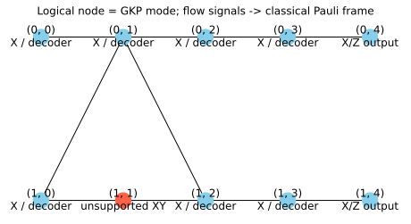

# Inspectable lowering

`lower_muta_to_gkp(model, parameters, config=config)` produces a
`PhysicalLoweringResult`. It holds the public `Pattern`, finite `GKPCode`,
input/output mode tuples, logical-node-to-mode map, measurement keys, frame
dependencies, decoder, configuration and capability/resource audit.

```python
from photographiqml import MuTA, GKPPhysicalConfig, lower_muta_to_gkp
model = MuTA(1)
config = GKPPhysicalConfig()
audit = model.physical_capabilities(config=config)  # No Fock projection.
assert audit["supported"]
lowered = lower_muta_to_gkp(model, config=config)  # Allocates finite codewords.
lowered.pattern.validate()
```

## Sequence and guards

The audit binds every parameter, including frozen values, and calls upstream
`GKPCode.logical_measurement("XY", alpha=...)` for every measured node. It then
checks the decoder, supported backend and allocation estimates. Execution also
checks mode, shot count, seed, analog postselection and normalized product inputs
before constructing the finite codewords.

The schedule starts with input modes and prepares each future neighbor just
before the first incident measured vertex needs it. Every graph edge receives one
unit `GKPCode.logical_cz` command. Measurements remove modes and free the live
frontier. This reordering uses commutation of CZ edges and operations on other
vertices; it preserves the logical open graph. It is not a change in MuTA topology.

For cutoff K and m simultaneously live modes, the exclusive total-photon basis has
dimension `comb(K+m-1,m)`. The audit reports 16D bytes for a pure vector,
and an estimated 64Dout² workspace for joint
output readout. These are allocation estimates, not a measured peak-memory bound;
backend transforms and temporary arrays can require additional memory.
The audit also budgets the finite-code projection grid using the conservative
estimate `64 * grid_points * (cutoff + 2*peaks + 1)` bytes, so an excessive
integration grid cannot bypass the preallocation policy.

Each readout writes a structured record under `("raw", node)`. A public `Signal`
with explicitly declared dependencies writes its interpreted bit under
`("bit", node)`. Final outputs keep their physical state and virtual frame.
The lowering contains no analog displacement implementing a qubit Pauli correction.

`model.draw_physical(parameters, config=config)` runs only the audit and draws
unsupported measurement vertices red. Inspect it before expensive simulation.


See [frames](pauli-frames.md) for the correction convention and
[execution modes](execution-modes.md) for result semantics.
