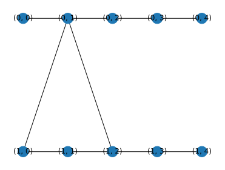

# 04 Triangle neuron anatomy

## Goal

Explore triangle neuron anatomy with an explicit representation contract.

## Theory

The MuTA triangle is a tip joined to both ends of a three-site base, forming a four-cycle in a bipartite graph.

## Code

Run from the installed repository environment.

```python
import numpy as np
import photographiqml as pqml
cell = pqml.TriangleNeuron(2)
assert cell.graph.has_edge((0,1), (1,0))
assert cell.graph.has_edge((0,1), (1,2))
print(sorted(cell.graph.edges))
```

## Output

Captured from this example during documentation generation:

```text
[((0, 0), (0, 1)), ((0, 1), (0, 2)), ((0, 1), (1, 0)), ((0, 1), (1, 2)), ((0, 2), (0, 3)), ((0, 3), (0, 4)), ((1, 0), (1, 1)), ((1, 1), (1, 2)), ((1, 2), (1, 3)), ((1, 3), (1, 4))]
```

## Visualization



The figure shows logical resource structure or its entanglement diagnostic; it is not a hardware layout.

## Validation

The assertions above are executed by `scripts/execute_tutorials.py`. The scientific
reference hierarchy is documented in [the mapping](../research/muta-mapping.md).

## Limitations

Five sites describe each wire segment, not the cardinality of the named triangle.

## Things to try

Change the explicit numerical values or supported model size, rerun the assertions,
and explain whether the expected identity or diagnostic should still hold. Record
the seed and representation whenever comparing results.
