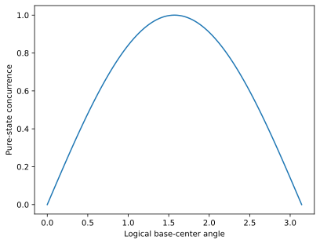

# 22 Tunable entanglement

## Goal

Explore tunable entanglement with an explicit representation contract.

## Theory

For exp(i phi XX/2)|00>, concurrence is |sin(phi)|, vanishing at zero and pi. This statement is specific to pure two-qubit outputs.

## Code

Run from the installed repository environment.

```python
import numpy as np
import photographiqml as pqml
from photographiqml.diagnostics import concurrence
m = pqml.MuTA(2,one_column=True)
phi = 0.7
c = concurrence(m.run([1,0,0,0],{'alpha.w1.c1':phi}).state)
assert np.isclose(c,abs(np.sin(phi)))
print(round(c,6))
```

## Output

Captured from this example during documentation generation:

```text
0.644218
```

## Visualization



The figure shows logical resource structure or its entanglement diagnostic; it is not a hardware layout.

## Validation

The assertions above are executed by `scripts/execute_tutorials.py`. The scientific
reference hierarchy is documented in [the mapping](../research/muta-mapping.md).

## Limitations

Do not use logical concurrence on Fock amplitudes or infer that every input is entangled by an entangling gate.

## Things to try

Change the explicit numerical values or supported model size, rerun the assertions,
and explain whether the expected identity or diagnostic should still hold. Record
the seed and representation whenever comparing results.
