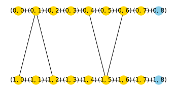

# 26 Custom observable readout

## Goal

Explore custom observable readout with an explicit representation contract.

## Theory

A logical output expectation is evaluated against a finite Hermitian matrix in wire order. Hermiticity and dimensions are checked.

## Code

Run from the installed repository environment.

```python
import numpy as np
import photographiqml as pqml
m = pqml.MuTA(1)
r = m.run([1,0])
value = r.expectation(np.diag([1,-1]))
assert np.isclose(value,1)
print(value)
```

## Output

Captured from this example during documentation generation:

```text
0.9999999999999993
```

## Visualization



The figure shows logical resource structure or its entanglement diagnostic; it is not a hardware layout.

## Validation

The assertions above are executed by `scripts/execute_tutorials.py`. The scientific
reference hierarchy is documented in [the mapping](../research/muta-mapping.md).

## Limitations

Physical quadratures, photon number and parity use PhotoGraphiQ state readouts and different units.

## Things to try

Change the explicit numerical values or supported model size, rerun the assertions,
and explain whether the expected identity or diagnostic should still hold. Record
the seed and representation whenever comparing results.
