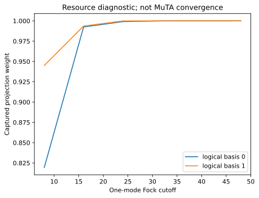

# 30 Comparing qubit, GKP and CV MuTA

## Goal

Explore comparing qubit, gkp and cv muta with an explicit representation contract.

## Theory

Logical fidelity, finite-codeword projection and Gaussian channel noise answer different questions. Keep each metric attached to its representation.

## Code

Run from the installed repository environment.

```python
import numpy as np
import photographiqml as pqml
r = pqml.GKPBridge(cutoff=24,grid_points=2049).diagnostics()
assert not r['physical_muta_validated']
assert all(0<w<=1.000001 for w in r['captured_weights'])
print('GKP captured weights:',np.round(r['captured_weights'],5))
```

## Output

Captured from this example during documentation generation:

```text
GKP captured weights: [0.99911 0.99983]
```

## Visualization



The figure shows finite GKP resource projection; it is not a hardware layout.

## Validation

The assertions above are executed by `scripts/execute_tutorials.py`. The scientific
reference hierarchy is documented in [the mapping](../research/muta-mapping.md).

## Limitations

Projection convergence does not certify GKP-MuTA gate convergence; MentPy does not validate raw CV physics.

## Things to try

Change the explicit numerical values or supported model size, rerun the assertions,
and explain whether the expected identity or diagnostic should still hold. Record
the seed and representation whenever comparing results.
